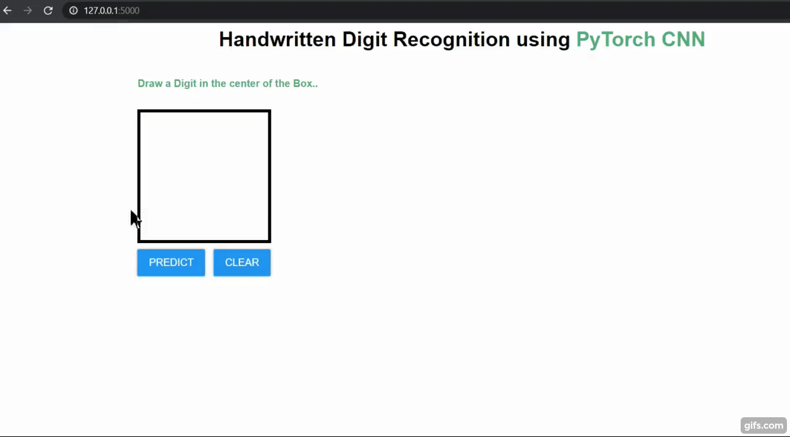

# Handwritten-Digit-Recognition-CNN-Flask-App-
A Convolutional Neural Network model created using PyTorch library over the MNIST dataset to recognize handwritten digits .  

The dataset can be downloaded from here :  
https://drive.google.com/drive/folders/1z4iFh1gJiRS3BpdzhYwf9tZGbh__CDNg?usp=sharing  
Download the dataset and store it in a folder(create new) named "data" in the main directory.
 

The MNIST dataset is an acronym that stands for the Modified National Institute of Standards and Technology dataset.

It is a dataset of 60,000 small square 28×28 pixel grayscale images of handwritten single digits between 0 and 9.

The task is to classify a given image of a handwritten digit into one of 10 classes representing integer values from 0 to 9, inclusively.

It is a widely used and deeply understood dataset and, for the most part, is “solved.” Top-performing models are deep learning convolutional neural networks that achieve a classification accuracy of above 99%, with an error rate between 0.4 %and 0.2% on the hold out test dataset.  
 

The handwritten digit recognition is the capability of computer
applications to recognize the human handwritten digits. It is a
hard task for the machine because handwritten digits are not
perfect and can be made with many different shapes and sizes.
The handwritten digit recognition system is a way to tackle this
problem which uses the image of a digit and recognizes the
digit present in the image.

### The handwritten digit recognition is the capability of computer applications to recognize the human handwritten digits. It is a hard task for the machine because handwritten digits are not perfect and can be made with many different shapes and sizes. The handwritten digit recognition system is a way to tackle this
### problem which uses the image of a digit and recognizes the digit present in the image. Convolutional Neural Network model created using PyTorch library over the MNIST dataset to recognize handwritten digits .

## Handwritten Digit Recognition is the capability of a computer to fete the mortal handwritten integers from different sources like images, papers, touch defenses, etc, and classify.  them into 10 predefined classes (0-9). This has been a  Content of bottomless- exploration in the field of deep literacy.  Number recognition has numerous operations like number plate recognition, postal correspondence sorting, bank check processing, etc . (2). In Handwritten number recognition,   we face numerous challenges . because of different styles of jotting of different peoples as it .  is not an Optic character recognition. This exploration provides a comprehensive comparison between different machine literacy and deep literacy algorithms for the purpose of handwritten number recognition. For this, we've used Support . Vector Machine, Multilayer Perceptron, and Convolutional . Neural Network. The comparison between these algorithms is carried out on the base of their delicacy, crimes, and .testing- training time corroborated by plots and maps that have been constructed using matplotlib for visualization.

# Datasets Details : -
The MNIST dataset is an acronym that stands for the Modified National Institute of Standards and Technology dataset.

It is a dataset of 60,000 small square 28×28 pixel grayscale images of handwritten single digits between 0 and 9.

The task is to classify a given image of a handwritten digit into one of 10 classes representing integer values from 0 to 9, inclusively.

It is a widely used and deeply understood dataset and, for the most part, is “solved.” Top-performing models are deep learning convolutional neural networks that achieve a classification accuracy of above 99%, with an error rate between 0.4 %and 0.2% on the hold out test dataset.

Handwritten character recognition is an extensive exploration area that formerly contains detailed ways of perpetration which include major literacy datasets, popular algorithms,  . features scaling and point birth styles. MNIST dataset ( Modified National Institute of Norms and Technology database) is the subset of the NIST dataset which is a combination of two of NIST’s databases Special.  Database 1 and Special Database 3. Special Database 1 and Special Database 3 correspond of integers written by high academy scholars and workers of the United States Census Bureau,.  independently. MNIST contains a aggregate of handwritten . number images (- training set and- test set) in .  28x28 pixel bounding box andanti-aliased. All these images have corresponding Y values which apprises what the number

# Implementation Steps : -
    Import the libraries and load the dataset
    Preprocess the data
    Create the model
    Train the model
    Evaluate the model
    Create GUI to predict digits

# Requirements .txt file :-
    torch
    numpy==1.16.5
    flask==1.1.1
    gunicorn
    matplotlib==3.3.1
    pillow==6.2.0
    flake8
    pip
    pylint
